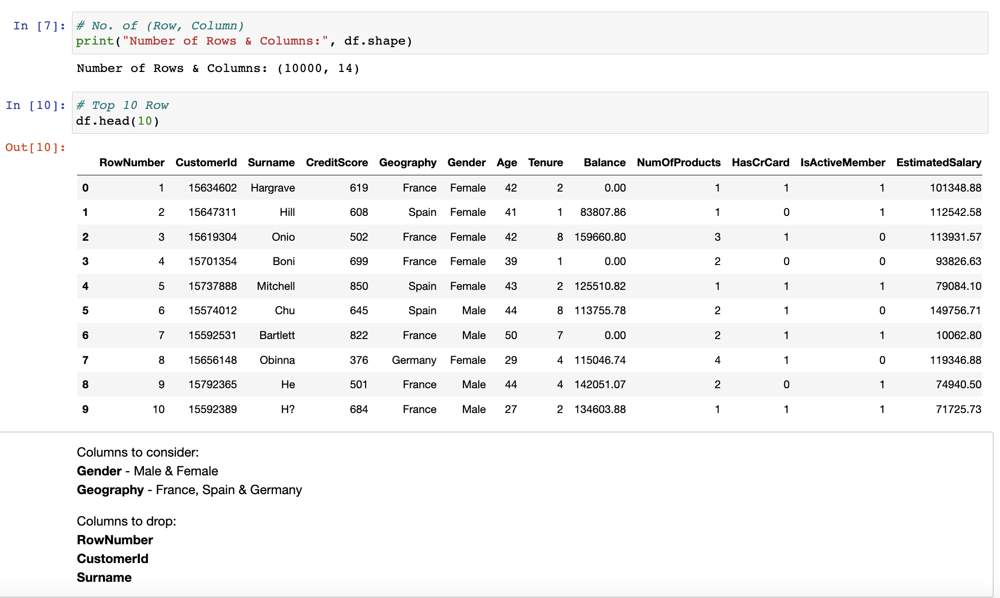
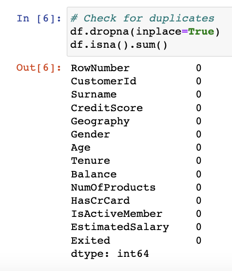

##### Capstone: Machine Learning with Python
---
---
# CHOOSING BETWEEN DECISION TREE & RANDOM FOREST FOR CUSTOMER CHURN

Purpose:
The purpose of this project is to look at two machine learning models and find out the following:

Which ML model has better accuracy score to predict churn.
Are there similarities and differences between them?
Dataset:
The dataset used in this project is a set of data from a bank in the US, and they are experiencing customer churn - Kaggle.

Enquirer:
The boss of ACDC Pte Ltd wants to know which machine learning model - Decision Tree OR Random Forest Classifier - will be the better model to predict customer churn.

**Data source:**
https://www.kaggle.com/datasets/shantanudhakadd/bank-customer-churn-prediction

### 02 EDA & DATA PRE-PROCESSING
List of libraries \

Gathering insights of data \

The data has NO missing values and also NO duplicates.

Three columns are Drop.

